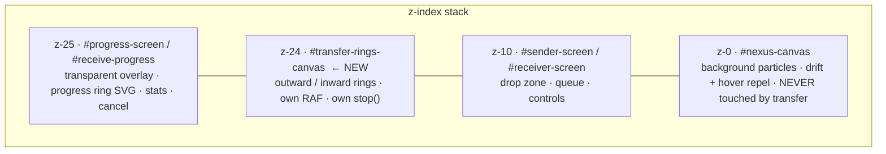
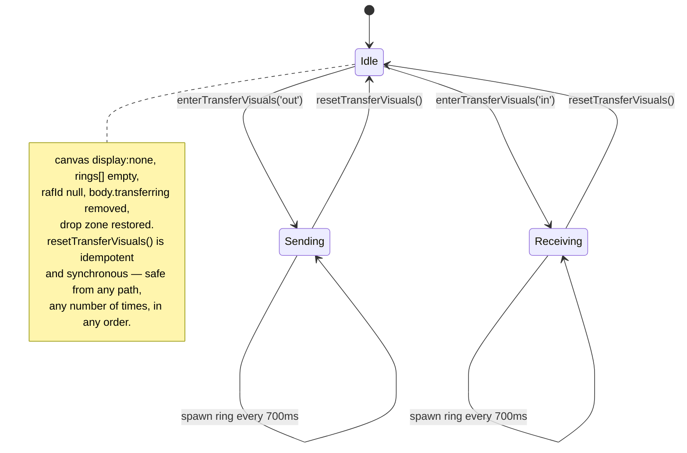

# fix: Replace particle transfer animation with radiating rings, repair OTP focus and drop-zone lifecycle

**Target repo:** `nexus-spatial-share` (this repo)

---

## Summary

Three user-facing defects share one root cause and one non-cause:

1. **Transfer animations stick after completion** because the send/receive animation *mutates the shared background particle field* rather than owning its own layer. Teardown is duplicated across eight call sites, each resetting a different subset of state. This has been re-patched five times (`code_debugged.md` #8, #19, #25, #26, #40) and keeps returning.
2. **The drop zone overlaps the transfer UI** because only the *sender* grab path hides it, and the path that restores it runs on a 6-second success timer that not every exit path reaches.
3. **OTP backspace lands the cursor in the wrong box** because three listeners (`keydown`, `beforeinput`, `input`) each independently implement erase-and-move-focus for the same keystroke, and two prior fixes encoded *opposite* focus rules that now coexist.

This plan replaces the transfer animation with a self-contained ring animation on a dedicated canvas, routes every enter/exit through a single lifecycle owner, banishes the drop zone via that same owner, and repairs the OTP handlers. It also delivers a written verdict on transfer-speed headroom with no transport code changes.

**Product Contract preservation:** No upstream brainstorm exists; this plan bootstraps its own contract from the user's request and direct code inspection.

---

## Problem Frame

Nexus Spatial Share is a room-code-paired, same-network P2P file transfer app (WebRTC data channels, custom sliding-window transfer engine). The transport layer is mature and well-tuned. The failures are all in the presentation layer, which lives as ~4,500 lines of imperative IIFE-scoped JavaScript inside `index.html`, driven by a headless React orchestrator (`src/App.tsx`) through `window.*` callbacks.

The architectural fault is that **transfer-time animation state and idle-background animation state are the same state**. `ParticleSystem.setGravityWell()` / `explodeSphere()` / `releaseAll()` operate on the one particle array that also renders the interactive background. Every transfer exit path must therefore correctly unwind the background too, and there is no single place that does it:

| Exit path | `index.html` | stops idle loop | clears well | `releaseAll()` | hides progress | restores drop zone |
| :-- | :-- | :-- | :-- | :-- | :-- | :-- |
| `completeTransfer()` | 2733 | yes | yes | via explode cb | yes | **no** (re-hides it) |
| `onTransferCancelled()` | 2787 | yes | no | yes | yes | via `resetSenderUI` |
| `leaveRoom()` | 2857 | yes | no | yes | yes | via `resetSenderUI` |
| `completeReceive()` finally | 3262 | yes | no | no | yes | **no** |
| `stopReceiverAnimation()` | 3360 | no | no | no | no | **no** |
| receiver reset | 3377 | yes | yes | yes | yes | **no** |
| `showPeerDisconnected()` | 3656 | no | no | conditional | yes | **no** |
| `resetSenderUI()` | 2882 | no | no | no | partial | yes |

Every "stuck animation" bug is a cell in this table that says *no*. Patching cells has failed five times. The fix is to delete the coupling.

---

## Goal Capsule

Ship a file-transfer UI where the background particle field is permanently live and hover-interactive, transfer progress is signalled by rings radiating outward (sending) or inward (receiving) from the progress ring's circumference, the drop zone disappears entirely during transfer and returns after it, and the room-code input behaves correctly on backspace and re-entry — on desktop and Android.

---

## Requirements

| ID | Requirement |
| :-- | :-- |
| R1 | The background particle field keeps drifting and repelling on hover at all times, including during transfer, and is never mutated by transfer state. |
| R2 | When the sender selects file(s) and clicks Send, rings radiate **outward** from the outer circumference of the sender progress ring for the duration of the transfer. |
| R3 | When the receiver's peer starts a transfer, rings radiate **inward** toward the outer circumference of the receiver progress ring for the duration of the transfer. |
| R4 | Ring animations are visible only during an active transfer, and stop on every exit path: success, cancel, peer disconnect, ICE failure, leave room, and error. |
| R5 | After any exit path, the UI returns to its normal idle state with no residual animation, no residual overlay, and no residual hidden elements. |
| R6 | The drag-and-drop box is fully removed from layout while a transfer is active on either role, and is restored intact when the transfer ends by any path. |
| R7 | Backspace on a **filled** OTP box clears that box and keeps focus in it. Backspace on an **empty** box clears the previous box and moves focus there. Exactly one box changes per keypress. |
| R8 | After clearing all four OTP digits, re-typing auto-advances through all four boxes and fires the join sequence at the fourth digit, on desktop and Android soft keyboards. |
| R9 | Ring visuals follow the repo design system (`UI UX files/DESIGN.md`) — tonal, glow-based, no hard lines. |
| R10 | The user receives a written assessment of whether transfer speed can be raised further or is at a practical ceiling, with the specific remaining lever identified. |

---

## Key Technical Decisions

**KTD1 — The transfer animation owns a dedicated canvas and never touches `ParticleSystem`.**
A new `#transfer-rings-canvas` layer with its own `requestAnimationFrame` loop, its own state, and one idempotent `stop()`. Rationale: this is the structural cure for the eight-call-site table above. A ring animation that shares no state with the background cannot leave the *background* stuck, regardless of which exit path fires or in what order — that failure mode is eliminated outright, not merely made less likely.

Precision on the claim: this does not make the transfer animation self-cleaning. The rings can still outlive a transfer if some path fails to call `resetTransferVisuals()` at all. What changes is that each exit path must get *one* call right instead of five, and a missed call can no longer corrupt the idle background. KTD2 and U7 cover the remaining single-call risk.
*(session-settled: user-approved — chosen over keeping the particle machinery as dormant dead code: leaving eight teardown call sites in place preserves the regression surface this plan exists to remove.)*

**KTD2 — One lifecycle owner: `enterTransferVisuals(mode)` / `resetTransferVisuals()`.**
Every path that begins a transfer calls the first; every path that ends one calls the second. `resetTransferVisuals()` is idempotent and synchronous, and is the only function permitted to stop the rings, hide progress overlays, and restore the drop zone. Rationale: the defect class is "one exit path forgot one step" — collapsing N partial teardowns into one total teardown removes the possibility.

**KTD3 — `resetTransferVisuals()` must not depend on any animation callback.**
No completion handler, RAF tick, or `setTimeout` chain may be load-bearing for returning to idle. Rationale: `completeTransfer()` currently reaches `releaseAll()` only through `explodeSphere`'s callback, and the loops carry `visibilityState === 'hidden'` early-returns added in fix #41. Teardown that rides on animation frames is teardown that can be stranded by a backgrounded tab.

**KTD4 — Drop zone is hidden with `display: none` via a `body.transferring` class, not opacity.**
Rationale: the user asked for it to be "completely banished". `.fade-out` sets `opacity: 0` but keeps the element in layout, and the receiver never applies it at all — the receiver shares the same layout under a now-transparent `#progress-screen` overlay, which is the reported overlap. A body-level class is also robust to which screen container the receiver actually renders.

**KTD5 — OTP fix is a minimal patch: deduplicate erase into one shared routine, keep the three listeners.**
The three listeners remain, but each delegates to a single `handleErase(i)` with a per-event re-entrancy guard, and the backspace focus rule is stated once. Rationale: the user chose patch over rewrite. Deduplicating the erase path is the smallest change that removes the actual conflict without restructuring the input layer.
*(session-settled: user-directed — chosen over a single-controller rewrite: user preferred the smaller diff. See Risks R-1.)*

**KTD6 — Transfer speed is analysed, not changed, in this plan.**
Rationale: the user chose a written verdict over code changes. The analysis and the identified lever are recorded below in **Transfer Speed Assessment** and the change is filed under Deferred to Follow-Up Work.
*(session-settled: user-directed — chosen over measure-then-flip `ordered:false`: user wanted this round kept to UI and bug work.)*

---

## High-Level Technical Design

### Canvas layer stack (after this change)



Rings sit directly beneath the progress ring SVG, so they read as emanating from behind it. `#sphere-canvas` (z-20), `#shockwave-canvas` (z-22), and `#ripple-canvas` (z-24) are retired by U4.

### Ring geometry

The emit radius is derived from the live DOM, not hardcoded, so it stays correct across breakpoints:

```text
.progress-ring-wrap  = 180 x 180 px box
  <circle r="80" stroke-width="4"/>   in a 180-unit viewBox
  outer edge = (80 + 4/2) / 180 = 0.4556 of box width

  rect   = wrap.getBoundingClientRect()
  originX = rect.left + rect.width  / 2
  originY = rect.top  + rect.height / 2
  R0      = rect.width * 0.4556        // circumference of the progress ring
```

### Ring lifecycle state machine



### Animation parameters (directional guidance, tune on screen)

| Property | Outward (sender) | Inward (receiver) |
| :-- | :-- | :-- |
| Spawn interval | 700 ms | 700 ms |
| Ring lifetime | 1400 ms | 1400 ms |
| Radius path | `R0 → R0 + 260px` | `R0 + 260px → R0` |
| Easing | ease-out (fast then settle) | ease-in (accelerate inward) |
| Alpha | `0.45 → 0` | `0 → 0.45 → 0.12` |
| Line width | `2 → 0.75` | `0.75 → 2` |
| Stroke | `#8ce7ff` → `#699cff` | `#ddb7ff` → `#8ce7ff` |
| Max concurrent | 4 | 4 |

Colours are the design system's tertiary (`#8ce7ff`), primary (`#699cff`), and secondary (`#ddb7ff`). Stroke-only, sub-half alpha — glow, not lines, per the DESIGN.md "no-line rule".

### OTP focus rules (single normative table)

| Key | Box state | Digits changed | Focus after |
| :-- | :-- | :-- | :-- |
| Backspace | box `i` filled | clear `i` only | **stays on `i`** |
| Backspace | box `i` empty, `i > 0` | clear `i-1` only | moves to `i-1` |
| Backspace | box `0` empty | none | stays on `0` |
| Digit | any | set `i` | `i+1` if `i < 3`, else stays on `3` |
| Delete | any | clear `i` only | stays on `i` |

Current code violates row 1 (`index.html:2283-2287` clears *and* moves back), which is exactly the reported "cursor is in the wrong position" symptom — the next digit typed overwrites the previous box.

---

## Implementation Units

### U1. Single transfer-visual lifecycle owner

**Goal:** Create the one function pair that every transfer enter/exit path routes through.
**Requirements:** R4, R5
**Dependencies:** none
**Files:** `index.html`

**Approach:** Add a small module near the Chapter 3 transfer code exposing `window.enterTransferVisuals(mode)` and `window.resetTransferVisuals()`. `enterTransferVisuals('out'|'in')` adds `body.transferring` and starts the rings. `resetTransferVisuals()` stops the rings, removes `body.transferring`, clears the ring canvas, and hides `#progress-screen` / `#receive-progress`. Both must be safe to call when already in that state.

Do not yet delete existing particle calls (U4 owns that) — this unit only establishes the owner so later units have somewhere to route to.

**Execution note:** Per KTD3, `resetTransferVisuals()` must complete its work synchronously in its own body. Verify by inspection that no branch defers work into a callback, RAF, or timer.

**Patterns to follow:** The existing `window.stopGravityWellIdle` pattern at `index.html:3023` — an IIFE-internal state mutator exposed on `window` so cross-chapter callers can reach it. `NexusIntegrationKnowledge.md` lesson 5 explains why this indirection is mandatory here.

**Test scenarios:**
- Calling `resetTransferVisuals()` twice in a row leaves the same state as calling it once (no thrown error, canvas hidden, `body.transferring` absent).
- Calling `resetTransferVisuals()` before any transfer has ever started does not throw.
- Calling `enterTransferVisuals('out')` then `enterTransferVisuals('out')` again does not create a second RAF loop (assert a single stored `rafId`).
- After `enterTransferVisuals('in')` → `resetTransferVisuals()`, `document.body.classList.contains('transferring')` is `false`.

**Verification:** Both functions callable from the browser console at any time, in any order, with no console errors and no visual residue.

---

### U2. `TransferRings` canvas module

**Goal:** Build the self-contained outward/inward ring renderer.
**Requirements:** R2, R3, R9
**Dependencies:** none
**Files:** `index.html`

**Approach:** Add `<canvas id="transfer-rings-canvas">` to the markup and a CSS rule `position: fixed; inset: 0; z-index: 24; pointer-events: none; display: none`. Implement a `TransferRings` IIFE holding `rings[]`, `rafId`, `mode`, and `lastSpawnAt`, exposing `start(mode)` and `stop()`.

Each frame: resolve the emit origin from the currently visible `.progress-ring-wrap` via `getBoundingClientRect()` (sender's when `#progress-screen.visible`, receiver's when `#receive-progress.visible`), spawn a ring if the interval has elapsed and fewer than 4 are alive, advance and draw each ring, and drop expired ones. Handle `window.resize` by recomputing from the rect each frame — no cached geometry.

`stop()` cancels the RAF, empties `rings[]`, clears the 2D context, and sets `display: none`. It takes no callback and returns nothing.

Honour `prefers-reduced-motion: reduce` by rendering a single static ring at `R0` with no radial motion.

**Execution note:** The RAF loop may skip work when `document.visibilityState === 'hidden'` (matching the CPU fix in `code_debugged.md` #41), but `stop()` must not be reachable only through that loop — see KTD3.

**Patterns to follow:** `playRipple()` at `index.html:3125` is the closest existing renderer (staggered rings, alpha decay, canvas show/hide) — mirror its drawing style, but not its lifecycle: it is fire-and-forget with a completion callback, whereas `TransferRings` is start/stop with no callback.

**Test scenarios:**
- `TransferRings.start('out')` with `#progress-screen` visible: canvas becomes `display: block` and ring radii increase frame over frame.
- `TransferRings.start('in')`: ring radii decrease frame over frame and converge on `R0`.
- Never more than 4 rings alive at once during a 10-second run.
- `stop()` mid-animation: canvas hidden, `rings.length === 0`, `rafId === null`, no further draws.
- Resizing the window mid-animation re-centres the origin on the next frame with no visual jump beyond the layout shift itself.
- With `prefers-reduced-motion: reduce` emulated, no radial motion occurs.
- Emit radius matches the progress ring's outer edge within 2px at both desktop (180px wrap) and mobile breakpoints.

**Verification:** Rings visibly emanate from the progress ring's edge in both directions, at both breakpoints, with the background particles still drifting and repelling on hover underneath.

---

### U3. Wire the ring animation into the sender and receiver transfer paths

**Goal:** Replace the particle-based transfer animation calls with the new lifecycle owner.
**Requirements:** R2, R3, R4
**Dependencies:** U1, U2
**Files:** `index.html`, `src/App.tsx`

**Approach:** In the `#btn-grab` handler (`index.html:2633`), call `enterTransferVisuals('out')` in place of the stop/set/start gravity-well sequence at lines 2652-2658. In `startReceive()` (`index.html:3164`), call `enterTransferVisuals('in')` in place of the `startGravityWellIdle()` at line 3174.

Route every exit path through `resetTransferVisuals()`: `completeTransfer()` (2733), `onTransferCancelled()` (2787), `leaveRoom()` (2857), `completeReceive()`'s `finally` (3262), `stopReceiverAnimation()` (3360), the receiver reset at 3377, and `showPeerDisconnected()` (3656).

In `src/App.tsx:1915`, remove the `ParticleSystem?.startTransfer(...)` bridge call. The progress-percentage bridges at 1919 (`updateSenderProgress`) and 1927 (`updateReceiverProgress`) stay — they drive the progress ring, which is unchanged.

**Execution note:** Work through the exit-path table in the Problem Frame as a checklist; the defect class here is a missed path, not a wrong implementation.

**Test scenarios:**
- Sender: select file → Send → outward rings appear within 600ms and the progress ring fills.
- Receiver on the same room: inward rings appear when the peer starts sending.
- Sender success: rings stop, success screen shows, background particles still drifting.
- Receiver success: rings stop, file lands in the files drawer, background still drifting.
- Cancel from sender mid-transfer: both peers stop rings and return to idle.
- Cancel from receiver mid-transfer: both peers stop rings and return to idle.
- Peer disconnect mid-transfer (kill one tab): surviving peer stops rings and shows the disconnect state.
- Leave room mid-transfer: rings stop and the home screen renders clean.
- Multi-file batch: rings run continuously across file boundaries without restarting, and stop once after the final file.
- Second consecutive transfer in the same session shows rings again (guards against the `rxTransferActive`-style latch of `code_debugged.md` #26).

**Verification:** Every row of the exit-path table returns both peers to a clean idle state.

---

### U4. Remove transfer-time particle coupling

**Goal:** Delete the code that lets transfer state reach the background particle field.
**Requirements:** R1, R5
**Dependencies:** U3
**Files:** `index.html`

**Approach:** Remove, in `index.html`:

- `window.startGravityWellIdle` / `window.stopGravityWellIdle` and the `gwLoopActive` guard (3009-3025) and all remaining call sites.
- `animateIncomingSphere()` including its gravity-spike burst (3032-3122) and `incomingSphereRafId`.
- `playRipple()` (3125-3162) and its call at 3254.
- `startShockwave()` (2908) and its call at 2661.
- `ParticleSystem.formSphere` / `startTransfer` / `explodeSphere` / `setGravityWell` / `clearGravityWell` / `isRepeller`, the `gravWell` branch in `Particle.updateDrift` (2012-2036), and the vestigial `PS_state` / `PS_transferActive` / `PS_progress` / `sphereActive` / `sphereCX/CY/SPHERE_R` fields.
- The `#sphere-canvas` (1694), `#shockwave-canvas` (1725), and `#ripple-canvas` (1829) elements and their CSS.
- The dead `window._PS_state !== 'sphere'` guard at 4045 and the `window._PS_getETA` / `_PS_getProgress` / `_PS_getSpeed` globals.

Keep `ParticleSystem.releaseAll()` and `shatterEffect()` only if a caller still needs them after the sweep; if none remains, remove them too. **Keep** `Particle.updateDrift`'s mouse-repel block (2006-2007) and the whole idle drift path — that is R1.

Retain `#gravity-well-ui` (the receiver's idle "waiting" ring visual, `index.html:1833`); it is a static DOM element with CSS-driven `.gw-ring` animation, unrelated to the particle field.

**Expected visible change:** the receiver's idle waiting screen currently also pulls background particles inward toward the centre (via `startGravityWellIdle()` at `index.html:3174` and the restore at 2831-2832). After this unit it will not — background particles drift and repel on hover only, in every state. This follows directly from R1 and is intended, but it is a user-visible difference from today's behaviour, so confirm it reads well before considering the unit done. `#gravity-well-ui`'s own CSS rings remain and continue to signal the waiting state.

**Execution note:** This is a deletion unit. Land it only after U3 is verified working, so that a regression can be bisected to wiring vs. deletion.

**Test scenarios:**
- `grep` for `setGravityWell|explodeSphere|formSphere|playRipple|startShockwave|gwLoopActive|incomingSphereRafId` in `index.html` returns no hits.
- `npm run lint` (`tsc --noEmit`) passes.
- Page loads with zero console errors; background particles drift on load.
- Hover over the background: particles repel; run this on the home screen, the sender screen, and mid-transfer.
- Full send/receive round trip still passes all U3 scenarios after the deletions.
- Idle CPU with the tab focused is no higher than before the change.

**Verification:** No remaining reference from transfer code into the particle field, and the background behaves identically to before in idle.

---

### U5. Banish and restore the drag-and-drop box

**Goal:** Remove the drop zone from layout during transfer on both roles; restore it on every exit.
**Requirements:** R6
**Dependencies:** U1
**Files:** `index.html`

**Approach:** Add CSS `body.transferring #drop-zone, body.transferring #queue-wrap { display: none !important; }`. The class is added by `enterTransferVisuals()` and removed by `resetTransferVisuals()` (U1), so both roles are covered by one rule.

Remove the ad-hoc drop-zone manipulation this replaces: `.fade-out` added at the grab handler (2646) and re-added in `completeTransfer()` (2746), and the `qw.style.opacity` juggling at 2647. Leave `resetSenderUI()`'s `dz.classList.remove('fade-out')` (2892) as a harmless belt-and-braces, or drop it once `.fade-out` has no other writer.

**Execution note:** Confirm at implementation time whether the receiver renders `#sender-screen` or `#receiver-screen` — `NexusIntegrationKnowledge.md` §5 says both roles share `#sender-screen`, but `#receiver-screen` exists in the CSS at 761. The body-level class is correct either way; this only affects which container you watch when verifying.

**Test scenarios:**
- Sender: drop zone is gone from layout (`getComputedStyle(...).display === 'none'`) the moment Send is clicked, with no overlap frame.
- Receiver: drop zone is gone from layout the moment inbound transfer starts.
- After sender success, the drop zone returns and accepts a click that opens the file picker.
- After receiver success, the drop zone returns.
- After cancel from either side, the drop zone returns.
- After peer disconnect mid-transfer, the drop zone returns.
- After leave-room and re-join, the drop zone renders normally.
- The drop zone never returns *during* an active transfer.
- Drag-and-drop still works after a completed transfer (listeners survive the display toggle — `display: none` does not detach them, but assert it).

**Verification:** No frame in which the drop zone and the transfer progress UI are both visible, and no exit path leaves the drop zone missing.

---

### U6. OTP backspace and re-entry focus patch

**Goal:** Make backspace change exactly one box with correct focus, and make re-entry after a full clear traverse all four boxes.
**Requirements:** R7, R8
**Dependencies:** none
**Files:** `index.html`

**Approach:** In the OTP block (`index.html:2278-2348`), extract a single `handleErase(i)` implementing rows 1-3 of the OTP focus table, and have all three listeners delegate to it:

- `keydown` (Backspace / `keyCode === 8`) → `preventDefault()` then `handleErase(i)` — desktop path.
- `beforeinput` (`deleteContentBackward`) → `handleErase(i)` — Android/IME path, where `keydown` reports `keyCode 229`.
- `input` with empty value → `handleErase(i)` only as a last-resort fallback.

Add a per-event re-entrancy guard so a single physical keypress that fires two of these paths performs exactly one erase — e.g. stamp the erase with `Date.now()` / an event-sequence token and no-op a second call within the same tick.

Fix the focus rule at 2283-2287, 2303-2307, and 2332-2336: backspace on a filled box **stays** on that box. This reverses the `code_debugged.md` #41 behaviour and restores #39's rule, which the table now states once as normative.

For R8, verify the `input` handler's auto-advance (2314-2331) after a full clear. `maxlength="2"` lets a box briefly hold two characters; confirm `setDigit` normalises to one and that `focus()` + `select()` on the next box is not re-entered by the `focus` listener at 2346 in a way that traps focus on box 3.

**Execution note:** The three-listener structure is retained per KTD5. Because the listeners still fan into shared state, verify the re-entrancy guard explicitly rather than assuming — that overlap is the mechanism behind six prior regressions.

**Patterns to follow:** The existing `setDigit(i, val)` single-writer at 2275 is already the right shape; route all mutations through it.

**Test scenarios (automatable with Playwright, per `test_browser.cjs`):**
- Type `1234`: each digit lands in its own box in order and focus ends on box 3.
- Backspace once after `1234`: box 3 is empty, boxes 0-2 unchanged, focus is on box 3.
- Backspace again: box 2 is empty, focus is on box 2. (Empty-box rule.)
- Type `9` at that point: it lands in box 2, not box 1, and focus moves to box 3.
- Backspace four times from `1234`: exactly one box clears per press; no press clears two.
- Clear all four, then type `5678`: all four land in order and focus advances to box 3.
- Clear all four twice in a row, then type: still traverses correctly (guards the stale-state bug of `code_debugged.md` #24 / #34).
- Backspace on box 0 when empty: nothing changes, no error, focus stays.
- Android emulation (Playwright device profile with a mobile UA): backspace clears one box per press via the `beforeinput` path.
- Paste `1234` into box 0: all four fill and focus lands on box 3.
- Arrow-left/right still move focus without changing digits.
- Entering the fourth digit fires the join sequence exactly once.

**Verification:** All the above pass in a Playwright run against a dev server, and a manual pass on a real Android device confirms the soft-keyboard path.

---

### U7. Full exit-path regression sweep

**Goal:** Prove the eight-call-site defect class is closed.
**Requirements:** R4, R5, R6
**Dependencies:** U1, U2, U3, U4, U5, U6
**Files:** `test_browser.cjs` (or a sibling script alongside it)

**Approach:** Extend the existing Playwright harness with a single-page assertion helper that reports the post-exit idle state: ring canvas hidden, `body.transferring` absent, drop zone displayed, progress overlays not `.visible`, no console errors. Drive the paths that a single page can reach (leave room, cancel confirm, error screen, direct `resetTransferVisuals()` calls). Record the genuine two-device paths as a manual checklist in the PR description.

**Execution note:** Verification-only unit; it adds no product behaviour. Its value is turning the exit-path table into something that fails loudly next time.

**Test scenarios:**
- Idle-state assertion helper returns clean after each single-page exit path.
- Two-device manual matrix — for each of {sender success, receiver success, sender cancel, receiver cancel, peer disconnect, leave room, batch multi-file}: both peers reach clean idle, and a second transfer immediately afterwards works.
- Backgrounding the tab mid-transfer and returning does not leave rings or overlays stranded (regression guard for the `visibilityState` early-returns).

**Verification:** Every row of the matrix passes on two real devices on the same network, once over Wi-Fi and once over hotspot.

---

## Transfer Speed Assessment

Delivered as analysis per KTD6 — no transport code changes in this plan.

**Current configuration is well-tuned.** `src/lib/TransferEngine.ts` uses 128 KB chunks with a 17-byte header, a LAN profile of 1024 chunks in flight (128 MB) capped by a 12 MB buffered-amount ceiling, AIMD with slow-start, three round-robin data channels on LAN and one on Wi-Fi, xxhash checksums on a 2-worker WASM pool, batched ACKs every 2 ms or 32 chunks, and direct random-access writes to the File System Access API with a RAM watchdog fallback. LZ4 is correctly gated behind a MIME whitelist (`TransferEngine.ts:30-34`), so already-compressed media skips compression instead of wasting CPU — a common mistake this codebase avoids.

**There is one unclaimed lever.** `src/App.tsx:1703` creates the three binary data channels with `{ ordered: true }`:

```ts
const dc = pc.createDataChannel(`data${i}`, { ordered: true });
```

Ordered delivery makes SCTP hold back every subsequent chunk behind one delayed or lost chunk (head-of-line blocking). The engine does not need it: each packet carries its own chunk index, its own xxhash, and its own original length; the receiver reassembles by index, NACKs what fails, and resumes from a manifest. Setting `ordered: false` (optionally with `maxRetransmits`) removes head-of-line blocking at no correctness cost.

Expected impact: **material on Wi-Fi and phone hotspot**, where loss and reordering are routine and a single stalled chunk currently blocks the channel; **marginal on clean wired LAN**, where loss is near zero and there is little to block on.

**Where the ceiling actually is.** Beyond that flag, you are close to the practical limit of browser WebRTC data channels rather than a limit of your code. Chrome's usrsctp implementation, not your window sizing, is what caps sustained data-channel throughput well below raw link speed on gigabit LAN. The remaining levers all have poor effort-to-gain ratios: moving `file.slice().arrayBuffer()` and packet assembly off the main thread into a worker would help most on low-end phones; chunk-size tuning above 128 KB interacts with `maxMessageSize` limits and risks fragmentation stalls.

**Recommendation:** flip `ordered: false` and measure before and after on both LAN and hotspot. If hotspot throughput does not improve, you are at the browser's ceiling and further transport work is not worth the risk. Filed under Deferred to Follow-Up Work below.

---

## Scope Boundaries

### In scope
Transfer-time animation replacement, the transfer visual lifecycle owner, drop-zone show/hide, OTP backspace and re-entry focus, removal of dead particle/sphere/ripple/shockwave code, and a written speed assessment.

### Deferred to Follow-Up Work
- **`ordered: false` on the three data channels** (`src/App.tsx:1703`), with before/after throughput measurement on LAN and hotspot. This is the concrete next step from the assessment above.
- **Worker-side packet assembly** — move `file.slice().arrayBuffer()`, LZ4, and header packing off the main thread. Worth it only if profiling shows main-thread starvation on low-end Android.
- **OTP single-controller rewrite** — the structural fix declined in KTD5. Revisit if U6 regresses.
- **`project_overview.md` accuracy pass** — it documents 2 MB chunks and unordered data channels; the code uses 128 KB chunks and ordered channels. Not corrected here to keep this plan's diff focused, but it is actively misleading.

### Out of scope
- The WebRTC signalling and room-pairing protocol (`server.ts`) — working as designed.
- `TransferEngine.ts` window sizing, AIMD, and profile thresholds.
- The MediaPipe gesture layer and camera lifecycle.
- The OPFS files drawer and save/download flows.
- The unimplemented new UI/UX layout under `UI UX files/` — `project_overview.md` marks that directory as a hard do-not-touch constraint, and this plan honours it. `DESIGN.md` is read as a reference for ring colours only.

---

## Risks & Dependencies

**R-1 — OTP patch may regress again (medium).** Six prior fixes to this input have failed, and two of them encoded opposite focus rules. KTD5 keeps the three-listener structure, so the fan-in that caused those regressions still exists; the mitigation is the shared `handleErase(i)` routine plus the re-entrancy guard, and the automated Playwright scenarios in U6 that would catch it next time. If it regresses once more, take the rewrite in Deferred.

**R-2 — Deleting particle code may hit an unlisted caller (low).** U4 removes a lot of code from a 4,500-line file. Mitigation: land U4 only after U3 is verified, grep for each removed identifier before deleting it, and rely on `npm run lint` plus a clean-console page load.

**R-3 — Receiver container ambiguity (low).** `NexusIntegrationKnowledge.md` says both roles share `#sender-screen`; the CSS also defines `#receiver-screen`. KTD4's body-level class is correct either way, but the U5 verification steps need the right container identified first.

**R-4 — Two-device verification is manual (accepted).** The genuine transfer paths need two devices on one network; Playwright covers only single-page state. U7 splits these explicitly rather than pretending automation covers it.

**Dependencies:** Playwright is already a devDependency and `test_browser.cjs` is a working harness pattern. No new packages are needed for this plan.

---

## Verification Contract

- `npm run lint` (`tsc --noEmit`) passes.
- Page loads with an empty console on the home, sender, and receiver screens.
- The Playwright OTP suite from U6 passes, including the mobile-UA profile.
- The U7 single-page idle-state assertions pass after every reachable exit path.
- The U7 two-device matrix passes on real hardware, once over Wi-Fi and once over hotspot.
- Background particles drift and repel on hover in every state, including mid-transfer.
- Manual Android pass confirms OTP backspace and re-entry on a real soft keyboard.

---

## Definition of Done

1. Sending shows rings radiating outward from the progress ring's circumference; receiving shows rings radiating inward. Neither appears outside an active transfer. (R2, R3, R4)
2. Every exit path — success, cancel from either side, peer disconnect, ICE failure, leave room, error — returns both peers to a clean idle state with no residual animation or overlay. (R4, R5)
3. The background particle field drifts and responds to hover at all times and is not referenced by any transfer code path. (R1)
4. The drag-and-drop box is absent from layout during transfer on both roles and restored intact afterwards, on every exit path. (R6)
5. OTP backspace changes exactly one box per press with focus per the normative table, and re-entry after a full clear traverses all four boxes on desktop and Android. (R7, R8)
6. Ring visuals use the design system's tertiary/primary/secondary accents as stroke-only glows. (R9)
7. All Verification Contract items pass.
8. The user has the speed assessment above, including the `ordered: false` lever and the ceiling explanation. (R10)

---

## Open Questions

- **When do the receiver's inward rings start — on `FILE_META` arrival, or after the receiver clicks Drop?** `startReceive()` is reached via `triggerIncomingSphere()` (`index.html:3308`), which `src/App.tsx:1443` calls when `FILE_META` arrives — which is *before* the receiver accepts, since `code_debugged.md` #35 deliberately removed auto-acceptance. Starting on `FILE_META` matches the stated intent ("as soon as the person sends a file, the receiver gets rings radiating inward") and gives the receiver an ambient cue that something is incoming. Starting after Drop keeps the animation strictly co-terminous with actual byte movement. Decide before U3; it changes which function calls `enterTransferVisuals('in')`.
- **Ring parameters are directional.** Spawn interval, travel distance, and alpha curve are starting values from the table in High-Level Technical Design. Expect to tune them on screen; the plan fixes the *shape* of the animation, not the exact numbers. One known rough edge in the starting values: inward rings end at alpha `0.12` and are then removed, which will read as a small pop at the ring's edge — easing to roughly `0.03` before removal is likely better.
- **Whether `ParticleSystem.shatterEffect()` survives U4** depends on whether the error/disconnect path still wants a visual cue once the transfer animation is decoupled. Decide during U4 rather than pre-committing.

---

## Sources & Research

- `project_overview.md` — architecture reference. Note: its chunk size (2 MB) and channel ordering (unordered) do not match the current code (128 KB, ordered); code was treated as authoritative.
- `NexusIntegrationKnowledge.md` — headless React ↔ DOM bridge, IIFE scope-control lesson (§5, lesson 5), symmetrical role layout (§5).
- `docs/solutions/architecture-patterns/nexus-ui-integration-2026-06-17.md` — same content at an earlier revision.
- `code_debugged.md` — 41 prior entries. Entries 8, 19, 25, 26, 40 are the recurring animation-teardown defect; 24, 29, 33, 34, 39, 41 are the recurring OTP focus defect. #39 and #41 encode opposite backspace focus rules.
- `UI UX files/DESIGN.md` — colour tokens and the no-line rule (read-only; the directory is a hard do-not-touch constraint per `project_overview.md`).
- Direct code inspection: `index.html` (animation lifecycle, OTP handlers, CSS layer stack), `src/App.tsx` (React bridge, data channel creation), `src/lib/TransferEngine.ts` (transport tuning).
- No `ArchitectureDecisions.md` exists in this repo; the two files above served as the architecture-decision record.
